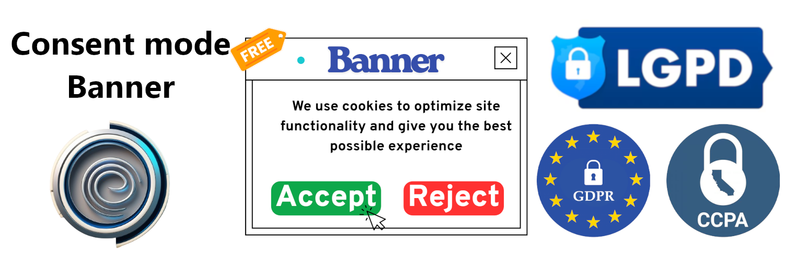

# :globe_with_meridians: This README is available in other languages:
- [English (main)](README.en.md)
- [Português (BR)](README.pt-br.md)

# Consent Mode Banner CMP – Toolz

**The easiest way to make your WordPress site compliant with privacy laws (GDPR, LGPD, CCPA) and build user trust.**

---

## Why use this plugin?

- **Instant compliance:** Add a professional consent banner in seconds, with no coding.
- **No branding, no tracking:** 100% white-label, privacy-first, and no public links.
- **Safe by default:** Only injects the banner if enabled and configured by the admin.
- **Works with any theme:** As long as your theme supports `wp_footer`.
- **Free and open source:** No hidden costs, no data collection, GPLv2 or later.

---

## Quick Start (2 minutes)

1. **[Generate your Banner ID](https://consentmode.toolz.at/en/generator)** (free, no registration).
2. **Install the plugin:**
	 - Download from [GitHub](https://github.com/Toolz-at/consent-mode-banner-cmp-toolz) (Code > Download ZIP).
	 - In WordPress, go to **Plugins > Add New > Upload Plugin** and select the ZIP.
	 - Click **Install Now** and **Activate**.
3. **Configure:**
	 - Go to **Settings > Consent Mode Banner CMP - Toolz**.
	 - Check **Enable Banner**.
	 - Paste your Banner ID.
	 - Save changes.
4. **Done!** Your site is now showing a compliant, privacy-friendly consent banner.

---

## Features

- Single Banner ID per site
- No public links, no branding, no tracking
- Script injected only if enabled and valid
- Attribute: `data-toolz-banner-id`
- Compatible: WordPress 5.0–6.6, PHP 7.4–8.x

---

## How it works

When enabled, the plugin injects the following in your site's footer:

```html
<script src="https://cdn.toolz.at/banner-cmp.js" data-toolz-banner-id="YOUR_ID"></script>
```

---

## FAQ

- **What if my theme doesn't show the banner?**
	Make sure your theme uses the standard `wp_footer` hook.
- **What if I enter an invalid ID?**
	The script will not be injected.
- **Is it really privacy-first?**
	Yes! No tracking, no data collection, no external branding.

---

## Security & Compliance

- No eval, no powered-by, no public links
- GPLv2 or later
- Does not collect or track data

---

## Screenshots




---

## Contributing

Pull requests welcome! See LICENSE for details.

---

## License

GPLv2 or later. See LICENSE file.

---

## Changelog

- 1.0.6 – Minor fixes and translation refresh
- 1.0.5 – Internationalization fixes and translation refresh
- 1.0.4 – Documentation updates
- 1.0.3 – GitHub repository update
- 1.0.2 – Minor text updates
- 1.0.1 – Bug fixes and minor improvements
- 1.0.0 – Initial release
---

**Keywords:** WordPress consent banner, cookie compliance, CMP, Toolz, LGPD/GDPR ready, footer injection, data attribute id
